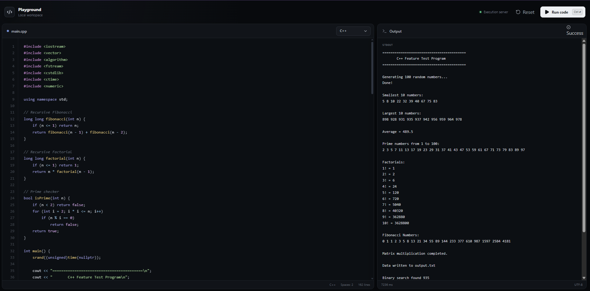
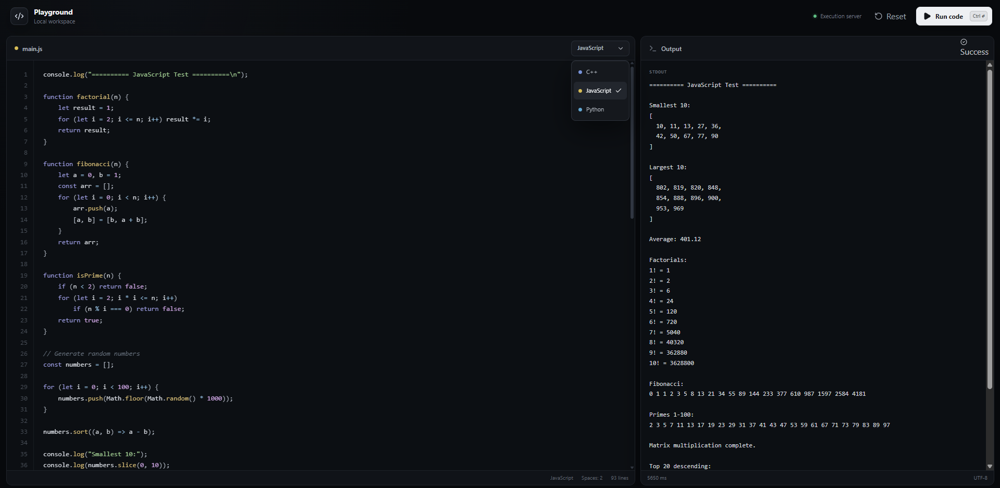
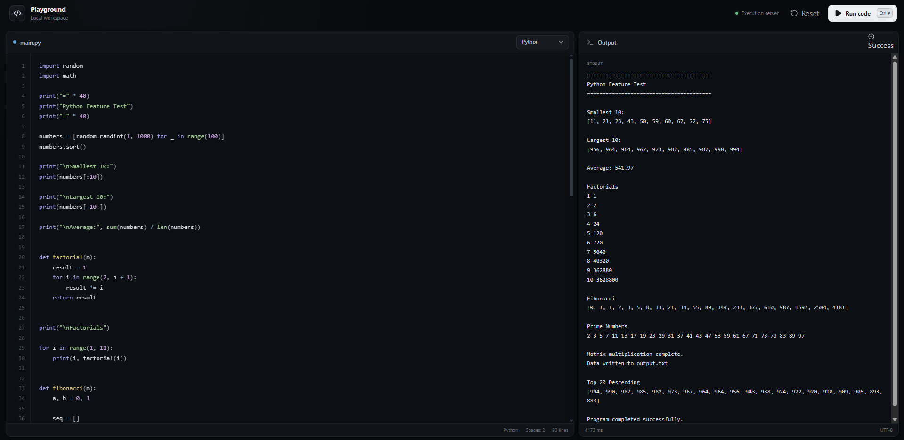
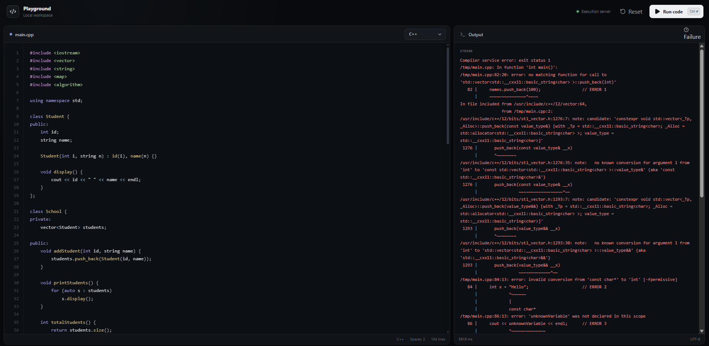

# Browser Coding Playground

A full-stack browser-based coding playground for writing, compiling, and executing **C++**, **JavaScript**, and **Python** code in isolated E2B sandboxes.

The project uses a React client, an Express API server, a Redis-backed job queue, Prisma for database persistence, and a dedicated worker for secure code execution.

---

## Application Showcase

<p align="center">
  
</p>

<p align="center">
  
</p>

<p align="center">
  
</p>

---

## Playground Error Showcase


<p align="center">
  
</p>

---

## Features

### Code Editor

- Browser-based source-code editor
- Support for C++, JavaScript, and Python
- Language-specific starter code
- Separate source code preserved when switching languages
- Language selector
- Current filename display
- Live line count
- Reset button for restoring starter code
- Run button with loading state
- Output and error terminal
- Execution-time display
- Responsive playground interface

### Keyboard Shortcuts

Run the selected code using:

| Platform | Shortcut |
|---|---|
| Windows/Linux | `Ctrl + Enter` |
| macOS | `⌘ + Enter` |

### Supported Languages

| Language | API identifier | Runtime/compiler |
|---|---|---|
| C++ | `cpp` | GCC with C++20 |
| JavaScript | `js` | Node.js |
| Python | `py` | Python 3 |

### Execution Results

The playground terminal can display:

- Standard output
- Standard error
- Compilation errors
- Runtime errors
- Non-zero exit codes
- Compilation timeouts
- Runtime timeouts
- Sandbox failures
- Execution-service failures
- Submission status
- Execution time
- Output truncation notifications

### Isolated Code Execution

Each code submission runs inside a separate E2B sandbox:

1. The client submits code to the API server.
2. The API validates and stores the submission.
3. The submission ID is added to Redis.
4. The worker receives the queued job.
5. A new E2B sandbox is created.
6. The source code is written to a temporary file.
7. C++ code is compiled when necessary.
8. The program or script is executed.
9. Standard output and standard error are captured.
10. The result is saved in the database.
11. The sandbox is terminated.

Temporary source-code paths:

```text
/tmp/main.cpp
/tmp/main.js
/tmp/main.py
```

### Resource and Timeout Controls

The worker includes configurable limits for running user-provided code:

- Sandbox creation timeout
- Sandbox cleanup timeout
- Overall execution deadline
- Separate compilation timeout
- Separate runtime timeout
- Forced process termination
- File-size limit
- Open-file limit
- Process-count limit
- JavaScript heap-size restriction
- Python isolated execution mode
- Maximum captured-output length
- Sandbox cleanup after execution

### Asynchronous Job Processing

Code execution happens outside the API request lifecycle:

- The API creates a submission with `Processing` status.
- The API pushes the submission ID to a Redis queue.
- A separate worker waits for jobs using Redis blocking operations.
- The worker compiles or runs the submitted code.
- The worker stores the execution result using Prisma.
- The client polls the API and displays the completed result.

This prevents compilation and code execution from blocking the web server.

### API Security and Validation

The Express API includes:

- Zod request validation
- UUID validation
- Maximum source-code length of 100,000 characters
- JSON request-body size limit
- CORS configuration
- Helmet security headers
- Request rate limiting
- Centralized error handling
- Generic internal-server error responses
- Graceful shutdown handling

### Reliability

- Invalid queue messages are rejected.
- Unsupported languages are marked as failed.
- Queue failures update the related submission.
- Worker failures attempt to mark submissions as failed.
- Late-created sandboxes are automatically terminated.
- Active sandboxes are tracked for shutdown cleanup.
- Redis and Prisma connections are closed during shutdown.
- Submission results are persisted in the database.
- Long output is automatically truncated.

---

## Architecture

```text
┌─────────────────────────┐
│      React Client       │
│ Editor + Output Panel   │
└────────────┬────────────┘
             │ HTTP
             ▼
┌─────────────────────────┐
│      Express API        │
│ Validation + Rate Limit │
└──────────┬───────┬──────┘
           │       │
           │       ▼
           │  ┌─────────────────┐
           │  │    Database     │
           │  │ Prisma Storage  │
           │  └─────────────────┘
           │
           ▼
┌─────────────────────────┐
│       Redis Queue       │
│       "problems"        │
└────────────┬────────────┘
             │
             ▼
┌─────────────────────────┐
│         Worker          │
│ Compile + Run + Capture │
└────────────┬────────────┘
             │
             ▼
┌─────────────────────────┐
│      E2B Sandbox        │
│  Isolated Code Runtime  │
└─────────────────────────┘
```

---

## Submission Lifecycle

```text
Processing ──────► Success
     │
     └──────────► Failure
```

A normal submission follows this sequence:

1. The user selects a language.
2. The user writes code in the editor.
3. The client sends `POST /submission`.
4. The server validates the request.
5. The server stores the submission as `Processing`.
6. The submission ID is pushed to Redis.
7. The worker receives the job.
8. The worker creates an E2B sandbox.
9. The code is compiled or interpreted.
10. Output and errors are captured.
11. The database record is updated.
12. The client retrieves and displays the result.

---

## Technology Stack

### Client

- React
- TypeScript
- Bun
- Lucide React
- Custom UI components
- CSS

### API Server

- Bun
- Express
- TypeScript
- Zod
- Prisma
- Redis
- Helmet
- CORS
- Express Rate Limit

### Worker

- Bun
- TypeScript
- Redis
- Prisma
- E2B
- GCC
- Node.js
- Python 3

### Infrastructure

- Redis for job queuing
- Prisma-supported database for persistence
- E2B for isolated code execution

---

## Project Structure

```text
.
├── client/
│   └── src/
│       ├── components/
│       │   ├── playground/
│       │   │   ├── language-select.tsx
│       │   │   ├── output-panel.tsx
│       │   │   └── syntax-editor.tsx
│       │   └── ui/
│       │       └── button.tsx
│       │       ├── card.tsx
│       │       ├── input.tsx
│       │       ├── label.tsx
│       │       ├── select.tsx
│       │       └── textarea.tsx
│       ├── hooks/
│       │   └── use-code-runner.ts
│       ├── lib/
│       │   ├── languages.ts
│       │   └── utils.tsx
│       ├── App.tsx
│       └── index.css
│
├── server/
│   ├── db.ts
│   └── index.ts
│
├── worker/
│   ├── db.ts
│   └── index.ts
│
├── e2b-template/
│   ├── coding-playground/
│   │   ├── build.dev.ts
│   │   ├── build.prod.ts
│   │   └── template.ts
│   ├── index.ts
│   └── test-sandbox.ts
│
└── README.md
```

---

## Prerequisites

Before running the project, install or configure:

- [Bun](https://bun.sh/)
- Redis
- A Prisma-supported database
- An E2B account
- An E2B API key
- An E2B template containing:
  - Bash
  - GNU `timeout`
  - GCC with C++20 support
  - Node.js
  - Python 3

---

## Environment Variables

### Server Environment

Create a server `.env` file:

```env
PORT=3000
REDIS_URL=redis://localhost:6379
CORS_ORIGIN=http://localhost:3003
DATABASE_URL=your_database_connection_string
```

| Variable | Required | Default | Description |
|---|---:|---|---|
| `PORT` | No | `3000` | API server port |
| `REDIS_URL` | Yes | — | Redis connection URL |
| `CORS_ORIGIN` | No | `http://localhost:3003` | Allowed client origin |
| `DATABASE_URL` | Yes | — | Prisma database connection URL |

### Worker Environment

Create a worker `.env` file:

```env
REDIS_URL=redis://localhost:6379
DATABASE_URL=your_database_connection_string

E2B_API_KEY=your_e2b_api_key
E2B_TEMPLATE=your_e2b_template_id

SANDBOX_TIMEOUT_MS=60000
COMPILE_TIMEOUT_SECONDS=20
RUN_TIMEOUT_SECONDS=5

SANDBOX_CREATE_TIMEOUT_MS=20000
EXECUTION_DEADLINE_MS=40000
SANDBOX_KILL_TIMEOUT_MS=10000

MAX_OUTPUT_CHARS=1000000
```

| Variable | Required | Default | Description |
|---|---:|---|---|
| `REDIS_URL` | Yes | — | Redis connection URL |
| `DATABASE_URL` | Yes | — | Prisma database connection URL |
| `E2B_API_KEY` | Yes | — | E2B API key |
| `E2B_TEMPLATE` | Yes | — | E2B sandbox template identifier |
| `SANDBOX_TIMEOUT_MS` | No | `60000` | Configured E2B sandbox timeout |
| `SANDBOX_CREATE_TIMEOUT_MS` | No | `20000` | Local sandbox-creation deadline |
| `SANDBOX_KILL_TIMEOUT_MS` | No | `10000` | Sandbox-cleanup deadline |
| `COMPILE_TIMEOUT_SECONDS` | No | `20` | Maximum C++ compilation time |
| `RUN_TIMEOUT_SECONDS` | No | `5` | Maximum program runtime |
| `EXECUTION_DEADLINE_MS` | No | `40000` | Overall worker execution deadline |
| `MAX_OUTPUT_CHARS` | No | `1000000` | Maximum captured output length |

Invalid or non-positive numeric values fall back to their defaults.

### Client Environment

Configure the API URL based on the implementation of `useCodeRunner`.

Example:

```env
VITE_API_URL=http://localhost:3000
```

---

## Installation

Clone the repository:

```bash
git clone https://github.com/AabhasAgarwal-AA/Coding-Playground.git
cd Coding-Playground
```

Install dependencies for each application:

```bash
cd server
bun install

cd ../worker
bun install

cd ../client
bun install
```

Install everything from the repository root:

```bash
bun install
```

---

## Database Setup

Generate the Prisma client:

```bash
bunx prisma generate
```

Run database migrations in development:

```bash
bunx prisma migrate dev
```

For production:

```bash
bunx prisma migrate deploy
```

The submission model should contain fields corresponding to:

```text
id
code
language
status
output
stdErr
createdAt
updatedAt
```

The application uses these submission statuses:

```text
Processing
Success
Failure
```

---

## Running the Application

### 1. Start Redis

```bash
redis-server
```

### 2. Start the Server

```bash
cd server
bun run index.ts
```

The server listens on port `3000` by default.

### 3. Start the Worker

Open another terminal:

```bash
cd worker
bun run index.ts
```

### 4. Start the Client

Open another terminal:

```bash
cd client
bun run dev
```

Open the client URL displayed by the Bun development server.

---

## API Reference

### Health Check

```http
GET /health
```

Example response:

```json
{
  "status": "ok"
}
```

---

### Create a Submission

```http
POST /submission
Content-Type: application/json
```

Example request:

```json
{
  "language": "cpp",
  "code": "#include <iostream>\nint main() {\n  std::cout << \"Hello, world!\";\n}"
}
```

Supported language values:

```text
cpp
js
py
```

Example response:

```json
{
  "message": "processing",
  "id": "submission-uuid",
  "status": "Processing"
}
```

The endpoint returns HTTP `202 Accepted` after the submission is stored and queued.

---

### Retrieve a Submission

```http
GET /submission/:submissionId
```

Example response:

```json
{
  "submission": {
    "id": "submission-uuid",
    "language": "cpp",
    "status": "Success",
    "output": "Hello, world!",
    "stdErr": null,
    "createdAt": "2026-01-01T00:00:00.000Z",
    "updatedAt": "2026-01-01T00:00:01.000Z"
  }
}
```

### Submission Statuses

| Status | Meaning |
|---|---|
| `Processing` | The submission is queued or currently executing |
| `Success` | The program completed with exit code `0` |
| `Failure` | Compilation, execution, queueing, or infrastructure failed |

---

## Language Execution

### C++

C++ code is compiled using settings equivalent to:

```bash
g++ -std=c++20 -O2 -pipe \
  -fdiagnostics-color=never \
  /tmp/main.cpp \
  -o /tmp/program
```

Compiler output is captured in:

```text
/tmp/compile-stdout
/tmp/compile-stderr
```

### JavaScript

JavaScript is executed with a restricted Node.js heap:

```bash
env NODE_OPTIONS=--max-old-space-size=256 node /tmp/main.js
```

### Python

Python runs in isolated mode without generating bytecode files:

```bash
python3 -I -B /tmp/main.py
```

### Runtime Limits

Programs run with resource restrictions equivalent to:

```bash
ulimit -f 2048
ulimit -n 64
ulimit -u 128
timeout --signal=KILL 5s <program>
```

The exact timeout values can be changed using environment variables.

---

## Error Handling

The playground terminal can display several types of errors.

### C++ Compilation Error

```text
Compilation failed
/tmp/main.cpp: In function 'int main()':
/tmp/main.cpp:4:5: error: expected ';' before '}'
```

### Compilation Timeout

```text
Compilation timed out after 20 seconds
```

### Runtime Error

```text
Program exited with code 1
```

### JavaScript Runtime Error

```text
Program exited with code 1
ReferenceError: value is not defined
```

### Python Runtime Error

```text
Program exited with code 1
Traceback (most recent call last):
  File "/tmp/main.py", line 1, in <module>
    print(undefined_value)
NameError: name 'undefined_value' is not defined
```

### Time Limit Exceeded

```text
Time limit exceeded after 5 seconds
```

### Unsupported Language

```text
Unsupported language
```

### Sandbox Failure

```text
Sandbox execution failed: <error message>
```

### Output Truncation

When output exceeds the configured maximum, the worker appends:

```text
[Output truncated]
```

---

## Security Considerations

This application executes user-provided code. E2B isolation and resource limits reduce risk, but production deployments should include additional protections:

- Keep API keys and database credentials outside source control.
- Use a dedicated E2B template with minimal permissions.
- Do not expose Redis publicly.
- Do not expose the database publicly.
- Add authentication and authorization.
- Add submission ownership checks.
- Apply per-user rate limits.
- Restrict sandbox network access when possible.
- Add maximum queue depth and concurrency controls.
- Monitor unusual submission and failure rates.
- Add retention rules for source code and execution output.
- Avoid returning sensitive infrastructure information.
- Keep runtimes and sandbox dependencies updated.
- Review E2B isolation guarantees before production use.
- Use separate queues or workers for different languages if needed.

---

## Current Limitations

- Only C++, JavaScript, and Python are supported.
- Programs cannot receive interactive standard input.
- Each submission supports only one source file.
- Package installation is not supported.
- The Redis list does not provide automatic retries.
- There is no dead-letter queue.
- Authentication is not included.
- Submission ownership is not included.
- Running jobs may be interrupted during worker shutdown.
- Output is limited by configured character and file-size limits.
- Real-time output streaming is not currently supported.
- The client server-status indicator is not necessarily connected to the `/health` endpoint.
- Each worker process handles submissions sequentially in its queue loop.

---

## Possible Improvements

- Add standard-input support
- Add multiple source files
- Add additional programming languages
- Add real-time output streaming
- Add WebSocket or Server-Sent Events support
- Add authenticated user accounts
- Add submission history
- Add public code-sharing links
- Add retry queues
- Add a dead-letter queue
- Add worker concurrency controls
- Add queue monitoring and metrics
- Add automatic cleanup of old submissions
- Add Docker support
- Add Docker Compose for local development
- Add automated tests
- Add code formatting
- Add static analysis
- Add editor themes
- Add mobile-responsive layouts
- Add configurable compiler arguments
- Add memory usage reporting
- Add live server-health checks

---

## Graceful Shutdown

Both the API server and worker listen for:

```text
SIGINT
SIGTERM
```

During shutdown:

- The worker stops accepting new queue work.
- Active E2B sandboxes are terminated.
- Redis connections are closed.
- Prisma disconnects from the database.
- The process exits after cleanup.

---

## Acknowledgements

Built with:

- [Bun](https://bun.sh/)
- [React](https://react.dev/)
- [Express](https://expressjs.com/)
- [Redis](https://redis.io/)
- [Prisma](https://www.prisma.io/)
- [E2B](https://e2b.dev/)
- [Zod](https://zod.dev/)
- [Helmet](https://helmetjs.github.io/)
- [Lucide](https://lucide.dev/)